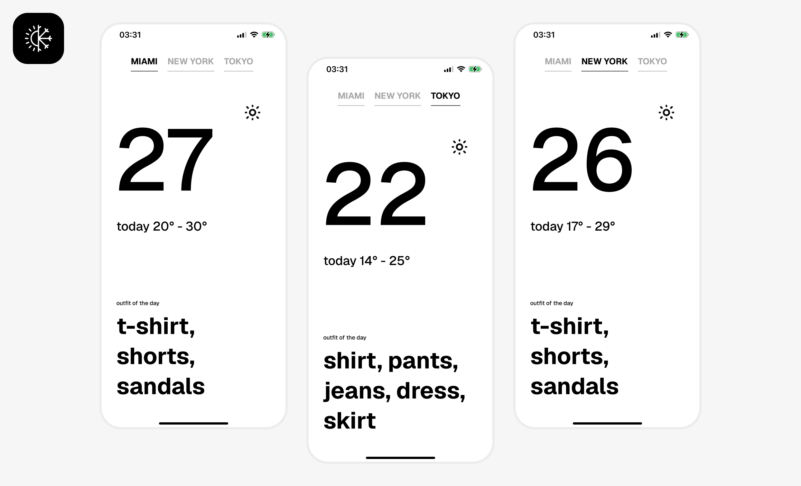

<div align="center">

# Weather App — UIKit

A minimalistic weather app for iOS. The interface is fully built in code with **UIKit**, following a design concept from Dribbble, and weather data comes from the **Xweather API**.


-4C8BF5)


</div>

<p align="center">
  
</p>

---

## Design

The screen recreates [«Minimalistic weather app concept»](https://dribbble.com/shots/20237166--C-Minimalistic-weather-app-concept) from Dribbble — built 1:1 with UIKit, no third-party UI libraries: bold typography, a clean black-and-white palette, and city-switcher tabs with an animated underline.

## Features

- Fully programmatic UIKit interface (no Storyboard/XIB, except LaunchScreen)
- Switch between cities — **Miami / New York / Tokyo** — with an animated tab selection
- Large current temperature + an approximate "today" range
- Weather icon picked based on the icon code returned by the API
- **"Outfit of the day"** block — a clothing recommendation based on temperature (range from −40° to +40°)
- Loading state (dimmed screen) and an alert on network errors
- Reactive View ↔ ViewModel binding via Combine (`@Published`)

## Architecture & Stack

- **Swift 5.0**, **UIKit** — the whole screen is built in code (Auto Layout), no storyboard
- **MVVM** — `WeatherViewModel` publishes state via `@Published`, the controller subscribes via Combine
- **Combine** — network request `URLSession.dataTaskPublisher` → `decode` → `sink`
- `ServiceProtocolWeather` — the weather service is hidden behind a protocol, making the implementation easy to swap
- A custom variable font, **Geist**, for typography

## API

Weather data comes from the [**Xweather Weather API**](https://www.xweather.com/docs/weather-api) — the `observations` endpoint is used (current readings from the nearest weather station):

```
https://data.api.xweather.com/observations/{city}?client_id=...&client_secret=...
```

### Setting up your own key

1. Sign up at [signup.xweather.com](https://signup.xweather.com) and create an app — you'll get a `Client ID` and `Client Secret`.
2. In the `Weather-App/Weather-App` folder, create a **`Secrets.xcconfig`** file (it's in `.gitignore` and never gets committed):

   ```
   WEATHER_CLIENT_ID = your_client_id
   WEATHER_CLIENT_SECRET = your_client_secret
   ```

3. These values are substituted into `Info.plist` (`WeatherClientID` / `WeatherClientSecret`) and read at runtime via `Secrets` (`Service/ServiceReadAPIKey.swift`). Without `Secrets.xcconfig`, the build fails with a `fatalError`.

## Data Models

Xweather's JSON response was turned into type-safe `Codable` models (`Model/ModelWeather.swift`) using **[app.quicktype.io](https://app.quicktype.io/)**: a real API response was fed into the tool, producing ready-made Swift structs (`ModelWeather`, `Response`, `Ob`, `Place`, `Profile`, etc.) with correct `CodingKeys`.

## Getting Started

1. Clone the repository:
   ```bash
   git clone https://github.com/Empty-Developer/Weather-iOS-App-UiKit.git
   ```
2. Set up your Xweather keys — see the [«API»](#☁️-api) section above.
3. Open `Weather-App/Weather-App.xcodeproj` in Xcode and run it on a simulator/device with iOS 26+.

## License

This project is distributed under the [MIT](LICENSE) license.